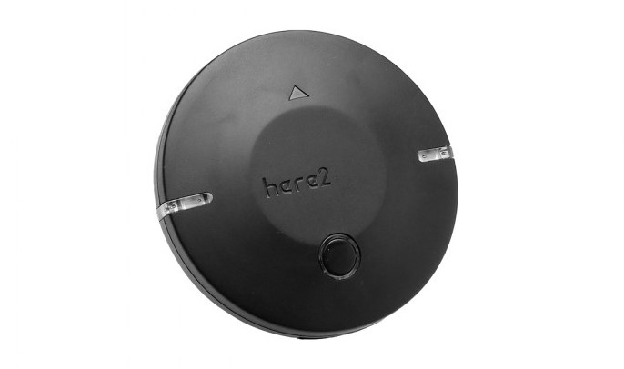

# HEX/ProfiCNC Here+ RTK GPS

The [Here2](http://www.proficnc.com/content/12-here) is a small, light and energy efficient [GPS module](../gps_compass/), based on the u-blox M8P. It is an upgraded version of the Here GNSS GPS unit which more accurate positioning and faster response. Not only that, Here2 runs an open architecture of a basic Chibios real-time operating system (RTOS) that lets users customize code and add functionality they need.

Here2 supports Serial I2C mode and the defaulted CAN mode. Users can select the suitable operating mode according to their requirement.

## Purchase

* [ProfiCNC](<http://www.proficnc.com/all-products/152-gps-module.html>)
* [Hex - China](http://www.hex.aero/shop/) (China)
* [Other resellers](http://www.proficnc.com/stores)

## Configuration

First time [setup](<http://www.hex.aero/wp-content/uploads/2019/03/Here2-CAN-Instruction.pdf>) via ardupilot and MissionPlanner is needed. After successfully setup the CAN node, you may switch back to PX4. CAN which UAVCAN protocol is the default communication mode for Here2. Procedure for switching to serial I2C mode can be found in the setup guide.

### Firmware Update

It is recommended to [update](<https://discuss.cubepilot.org/t/here-2-can-update/471/13>) to latest firmware to obtain better performance. Here2 can be updated on MissionPlanner via a Cube running ardupilot, then switch back to PX4.

## Wiring and Connections

The Here2 GPS comes with an 8 pin connector and a 4 pin CAN connector that can be inserted directly into the [Pixhawk 2](http://www.hex.aero/wp-content/uploads/2016/07/DRS_Pixhawk-2-17th-march-2016.pdf) GPS UART port or CAN port respectively.

The Pixhawk 3 Pro and Pixracer have a 6 pin GPS port connector. For these controllers you can modify the GPS cable (as shown below) to remove pin 6 and 7. 

 

Pin 6 and 7 are for the safety button - these can be attached as well if needed.

### Pinout

The Here+ GPS pinout is provided below. This can be used to help modify the connector for other autopilot boards.

##### CAN mode
| pin  | Here+ GPS  |  Description     |
| ---- | ---------- | ---------------- |
| 1    | VCC_5V     | VCC Power Supply |
| 2    | -          | -                |
| 3    | -          | -                |
| 4    | CAN_H      | CAN High         |
| 5    | CAN_L      | CAN Low          |
| 6    | -          | -                |
| 7    | -          | -                |
| 8    | GND        | GND              |

##### Serial I2C mode

| pin  | Here+ GPS  | pin  | Pixhawk 3 Pro GPS |
| ---- | ---------- | ---- | ----------------- |
| 1    | VCC_5V     | 1    | VCC               |
| 2    | GPS_RX     | 2    | GPS_TX            |
| 3    | GPS_TX     | 3    | GPS_RX            |
| 4    | SCL        | 4    | SCL               |
| 5    | SDA        | 5    | SDA               |
| 6    | BUTTON     | -    | -                 |
| 7    | BUTTON_LED | -    | -                 |
| 8    | GND        | 6    | GND               |
